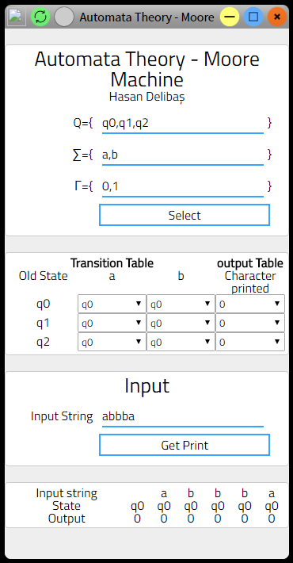

# Düzenli İfadeler
Otomata teorisindeki düzenli ifadelerin anlaşılması için geliştirilmiş basit bir program.
Programı görmek için : <a href='www.neproje.com/public/otomata/duzenli-ifade/'> www.neproje.com/public/otomata/duzenli-ifade/ </a>

# MooreMachine
Otomata teorisi konularından moore makinesi

Bu proje ile moore makinasının nasıl çalıştığına ilişkin bilgiler edinebilirisiniz.

